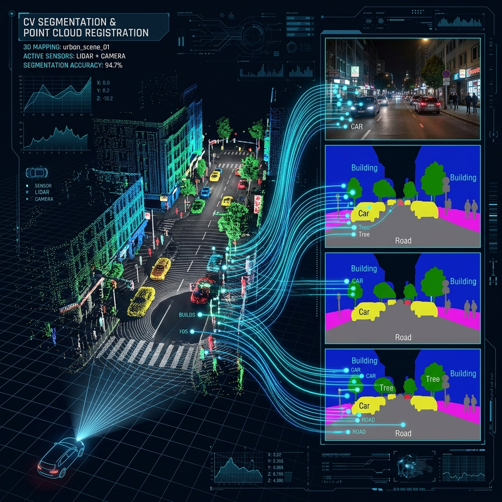

# 📸 2D-3D-associator



## 🌐 Project Overview
**2D-3D-associator** is a specialized framework designed for the **Joint 2D-3D Segmentation and Association** in street-level imaging. This repository contains the official code and implementation for our paper presented at **ICPR 2026**.

The project bridges the gap between 2D semantic information (from image-based masks) and 3D geometric data (from COLMAP reconstructions), enabling robust tracking and association of objects across different views in a 3D space.

🔗 **Project Page:** [http://www.ok.sc.e.titech.ac.jp/res/Seg2D3D/](http://www.ok.sc.e.titech.ac.jp/res/Seg2D3D/)

---

## ✨ Key Features
- **COLMAP Integration:** Seamlessly reads and processes COLMAP sparse reconstructions (cameras, images, and 3D points).
- **2D-3D Association:** Maps 2D keypoints and semantic masks to their corresponding 3D points in the reconstructed scene.
- **Mask Processing:** Supports loading and processing of `.npy` semantic masks for 2D-3D alignment.
- **Efficient Visualization:** Tools for projecting 3D points onto 2D frames and visualizing association results.
- **Data-Driven Analysis:** Extracts and structures relationships between image IDs, keypoint indices, and point3D IDs.

---

## 🛠 Workflow
The main logic is demonstrated in the `track_images_in_3d_clean.ipynb` notebook:
1.  **Initialization:** Load necessary libraries and define paths for sparse models and output directories.
2. **Run Segmentation:** (if needed)This will generate 2D semantic masks for each image using Grounded-SAM.
3.  **Model Loading:** Read COLMAP binary files (`.bin`) to reconstruct the `cameras`, `images`, and `points3D` data structures.
4.  **Point Association:** Identify which 3D points are visible in specific 2D images and link them to 2D keypoints.
5.  **Mask Alignment:** Load 2D semantic masks and check if projected 3D points fall within specific semantic regions.
6.  **Result Generation:** Output associated data for further tracking or segmentation tasks.
7. **Ground Truth Comparison:** Compare the results with the ground truth data to evaluate the performance (where available).

---

## 📂 Data Structure
In addition to source images, the project also uses COLMAP data structures:
- **`Images`:** Contains pose data (quaternions, translation), camera IDs, and 2D-3D point mappings.
- **`Points3D`:** Stores 3D coordinates, RGB values, and the "track" of 2D image observations.
- **`Masks`:** 2D semantic segmentation masks (e.g., from SAM or Mask R-CNN) stored as numpy arrays.

## 🚀 Getting Started
### Prerequisites
Ensure you have the following installed:
- Python 3.8+
- OpenCV
- NumPy
- Matplotlib
- Pandas
- ImageIO

### Quick Start
1. Clone the repository:
   ```bash
   git clone https://github.com/your-username/2D-3D-associator.git
   cd 2D-3D-associator
   ```
2. Open the notebook to explore the association pipeline:
   ```bash
   jupyter notebook track_images_in_3d_clean.ipynb
   ```

---

## 📜 Citation
If you find this work useful in your research, please cite:
```bibtex
@inproceedings{seg2d3d2026,
  title={Joint 2D-3D Segmentation and Association in Street-level Imaging},
  author={Melnikov A. et al.},
  booktitle={Proceedings of the International Conference on Pattern Recognition (ICPR)},
  year={2026}
}
```

---

## 📄 License
This project is licensed under the MIT License - see the [LICENSE](LICENSE) file for details.
